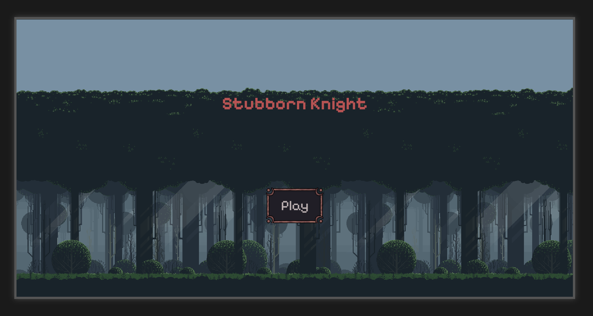

Stubborn Knight

A fun and interactive Rock, Paper, Scissors game built with HTML, CSS, and JavaScript. Battle against the Necromancer in a pixelated arena and see who emerges victorious!
Table of Contents

    Introduction

    Features

    How to Play

    Installation

    Technologies Used

    Contributing

    License

    Acknowledgements

Introduction

This project is a web-based implementation of the classic Rock, Paper, Scissors game with a twist! You play as a brave Knight battling against a powerful Necromancer. The game features pixel art, animations, and dialogue to create an immersive experience.
Features

    Interactive Gameplay: Choose between Rock, Paper, or Scissors to defeat the Necromancer.

    Pixel Art Design: Enjoy a retro-style pixelated aesthetic.

    Animations: Watch the Knight and Necromancer come to life with smooth animations.

    Dialogue System: Engage in humorous and dramatic dialogue with the Necromancer.

    Responsive Design: Play on both desktop and mobile devices (landscape mode recommended).

    Winning Screens: Celebrate your victory or face defeat with custom end-game screens.

How to Play

    Start the Game: Click the "Play" button on the welcome screen.

    Choose Your Attack: Select Rock, Paper, or Scissors to battle the Necromancer.

    Win the Game: Be the first to win 1 round to claim victory.

Coming Soon

    More Enemies tp defeat back to back

    Expanded Dialogue
    
Installation

To run this project locally, follow these steps:

    Clone the Repository:
    bash
    Copy

    git clone https://github.com/TheDermot/rock-paper-scissors.git

    Navigate to the Project Directory:
    bash
    Copy

    cd rock-paper-scissors-game

    Open the Game:

        Open the index.html file in your browser.

        Alternatively, use a local server (e.g., VS Code Live Server) to run the game.

Technologies Used

    HTML5: Structure of the game.

    CSS3: Styling and animations.

    JavaScript: Game logic and interactivity.

    Pixel Art: Custom sprites and backgrounds.

    Google Fonts: Pixelify Sans for the retro font style.

Contributing

Contributions are welcome! If you'd like to contribute to this project, please follow these steps:

    Fork the repository.

    Create a new branch for your feature or bugfix:
    bash
    Copy

    git checkout -b feature/your-feature-name

    Commit your changes:
    bash
    Copy

    git commit -m "Add your commit message here"

    Push to the branch:
    bash
    Copy

    git push origin feature/your-feature-name

    Open a pull request and describe your changes.

License

This project is licensed under the MIT License. See the LICENSE file for details.

Acknowledgements

    Pixel Art Assets: Sourced from https://brackeysgames.itch.io/brackeys-platformer-bundle, https://creativekind.itch.io/necromancer-free, https://edermunizz.itch.io/free-pixel-art-     forest

    Inspiration: Inspired by classic Rock, Paper, Scissors games and pixel art aesthetics.

    Special Thanks: To the open-source community for tools and resources.

Live Demo

Play the game live here: [GitHub Pages Link](https://thedermot.github.io/rock-paper-scissors/)
Contact

If you have any questions or feedback, feel free to reach out:

    Email: dermotcraft@gmail.com

    GitHub: https://github.com/TheDermot
This README.md template is designed to be clear, concise, and informative. It provides all the necessary details about your project while following best practices for readability and organization. Let me know if you need further customization!
